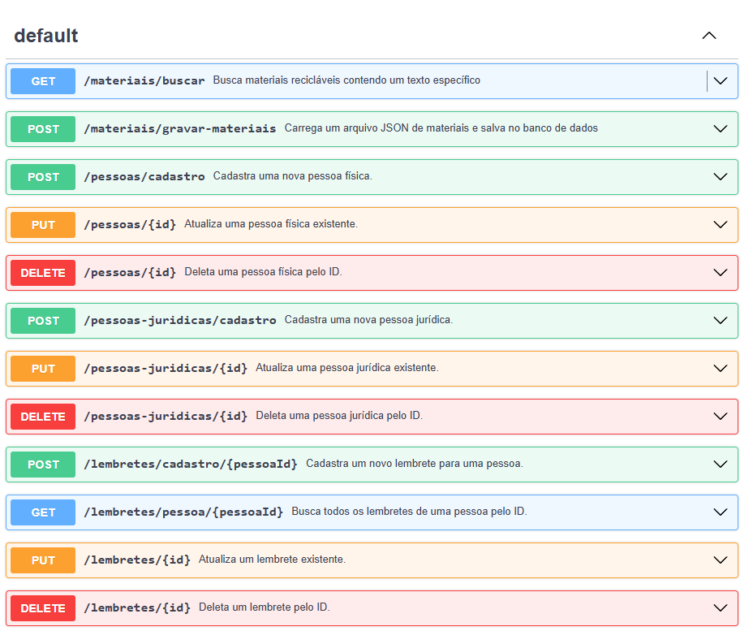

# Projeto de UPX - Grupo 16

# API de Gerenciamento de Pessoas e Centros de Reciclagem



API para gerenciar pessoas físicas, centros de reciclagem e lembretes associados.

## Descrição

Essa API permite o gerenciamento de pessoas físicas e jurídicas (centros de reciclagem), bem como o cadastro e busca de lembretes associados a essas pessoas. A API está documentada usando o formato OpenAPI, e você pode visualizá-la e interagir com os endpoints diretamente no [Swagger Editor](https://editor.swagger.io/).

### Funcionalidades Principais

1. **Cadastro de Pessoas Físicas**
2. **Cadastro de Centros de Reciclagem (Pessoas Jurídicas)**
3. **Busca de Centros de Reciclagem por Cidade**
4. **Cadastro de Lembretes**
5. **Busca de Lembretes por Pessoa**

## Tecnologias Utilizadas

- **Back-end**: Java com Spring Boot e Spring Data JPA
- **Banco de Dados**: PostgreSQL
- **Documentação da API**: Swagger/OpenAPI 3.0
- **Front-end**: HTML, CSS e JavaScript com Fetch API para consumo da API

## Estrutura da API

### Endpoints

#### Cadastro de Pessoas Físicas

- **Endpoint**: `/pessoas/cadastro`
- **Método**: `POST`
- **Descrição**: Cadastra uma nova pessoa física.
- **Body**:
  ```json
  {
    "nome": "string",
    "email": "string",
    "senha": "string",
    "cep": "string",
    "rua": "string",
    "bairro": "string",
    "cidade": "string",
    "estado": "string"
  }

## Cadastro de Centros de Reciclagem

**Endpoint:** `/pessoas-juridicas/cadastro`
**Método:** POST
**Descrição:** Cadastra uma nova pessoa jurídica (centro de reciclagem).

**Body (JSON):**
```json
{
  "nome": "string",
  "email": "string",
  "senha": "string",
  "cep": "string",
  "rua": "string",
  "bairro": "string",
  "cidade": "string",
  "estado": "string"
}
```
## Busca de Centros de Reciclagem por Cidade

**Endpoint:** `/pessoas-juridicas/buscar/{nome_da_cidade}`
**Método:** GET
**Descrição:** Retorna todos os centros de reciclagem de uma cidade especificada.

## Cadastro de Lembretes

**Endpoint:** `/lembretes/cadastro/{id_pessoa}`
**Método:** POST
**Descrição:** Cadastra um novo lembrete associado a uma pessoa.

**Body (JSON):**
```json
{
  "nome": "string",
  "data": "yyyy-MM-dd",
  "horario": "HH:mm:ss"
}
```
## Busca de Lembretes por Pessoa

**Endpoint:** `/lembretes/buscar/{id_pessoa}`
**Método:** GET
**Descrição:** Retorna todos os lembretes cadastrados para uma pessoa especificada.

## Front-end

O front-end foi criado em HTML, CSS e JavaScript para consumir essa API. A interface principal permite a busca de materiais de reciclagem e exibe os resultados de forma interativa. Além disso, há formulários de cadastro para pessoas físicas e jurídicas.

### Como Usar

* **Busca de Materiais:** Interface para busca de materiais de reciclagem.
* **Cadastro de Pessoas:** Formulário para cadastro de pessoas físicas.
* **Cadastro de Centros de Reciclagem:** Formulário para cadastro de centros de reciclagem.

## Executando o Projeto

1. Clone o repositório.
2. Execute o servidor back-end com Spring Boot.
3. Abra `index.html` no navegador para acessar o front-end.

## Dependências

* Spring Boot
* Spring Data JPA
* PostgreSQL
* Jackson

## Como Executar o Swagger

Para visualizar a documentação interativa no Swagger Editor, siga os passos abaixo:

1. **Copie o conteúdo YAML da API.**
2. **Acesse o Swagger Editor.** Você pode encontrá-lo online em https://editor.swagger.io/.
3. **Cole o conteúdo YAML** copiado no editor e visualize os endpoints da API.

## Contato

Para dúvidas ou sugestões, entre em contato com o desenvolvedor.
